<!---->
<h3 align="center">
Hi!👋 
</h3>
<!--
## 👨‍💻 About Me
<!--- 🔭 I’m on a mission to simplify this over-complicated world.🚀
- 🌱 My interests - Product Design, Backend Development, System Design, Blockchain, Defi, Building Cross-platform applications, Infrastructure, Cloud & AI.🎉
- 💟 I love to design, architect and develop impactful and robust products which aim to solve real-world problems.🧑‍💻
- 👯 I’m looking for passionate people with common interests and goals. 📖
- 💯 I help people achieve their goals with impactful mentorship and techniques.🖥️ -->
<!-- - 📫 How to reach me: -->
<!-- Actual text -->
<!-- You can find me on [Email](mailto:andrea1.bellani@mail.polimi.it) or [LinkedIn](https://www.linkedin.com/in/ImAndreaBellani) -->
<!-- ## 💼 Technical Skills -->

## 📌 Pinned repos
### 💻💻 Master's degree projects

### 💻 Bachelor's degree projects

### 📓 High school's projects

## 📈 Github Stats

  

  

&nbsp;

